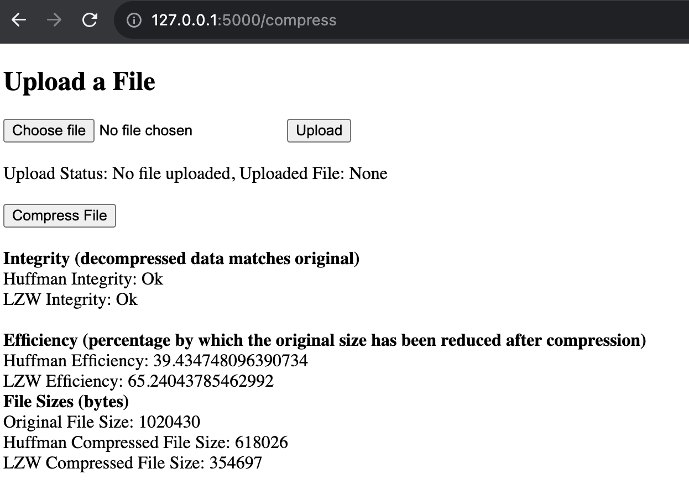
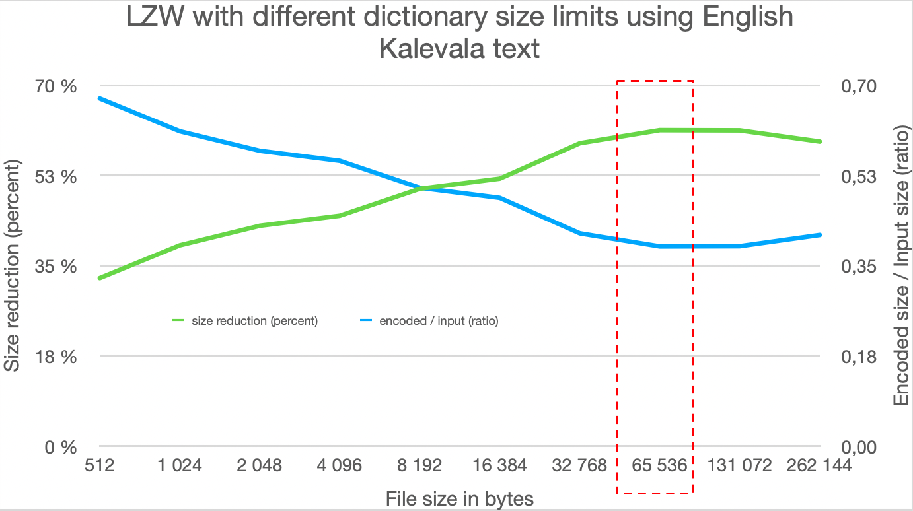
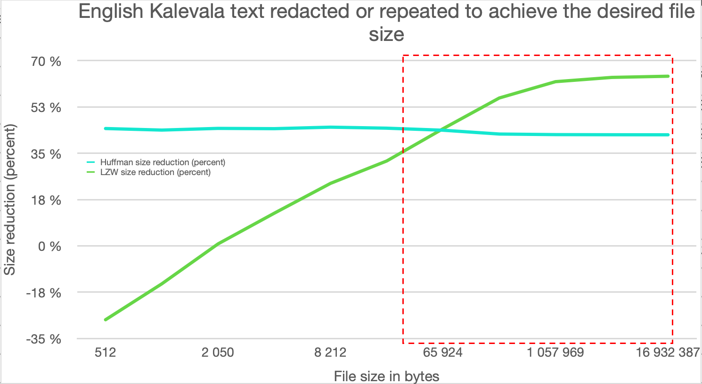

# Implementation
This application implements Huffman and Lempel-Ziv-Welch (LZW) data compression algorithms.

## UI
- The application has a simple user interface built with Python Flask.
- Users can upload files using the "Choose File" and "Upload" buttons.
- Compression performance tests run during the compression process, initiated by the "Compress File" button.
- Efficiency (size reduction calculated as 1 - compressed file size / original file size) and integrity checks (decompressed data matches original data) are displayed on the homepage.

To run the application, refer to the README on the front page.



## File Handling
- The "assets" folder stores uploaded and compressed files.
- Files are processed in byte format during compression.

## Compression Algorithms

### Huffman Algorithm

- Huffman tree is built from character frequencies, using a priority queue (minheap) to position less frequent characters at the bottom.
- Huffman codes are generated based on tree positions, assigning shorter codes to more frequent characters.
- Characters are replaced with their corresponding Huffman codes for compression.
- Compressed data is padded with zeros to make it a multiple of 8 bits. The number of padding bits is stored as the first byte (leftmost) of the compressed data.
- Decompression is done by traversing the Huffman tree using the Huffman codes, starting from the root and moving left for '0' and right for '1', until a terminal leaf node is reached.
- Time complexity for Huffman algorithm is O(n log n) where n is the size of the data. Building the Huffman tree takes O(n log n), while encoding and decoding takes O(n). Although encoding and decoding are linear, the tree building step dominates, making the overall time complexity O(n log n).

The data structure of the compression (or rather how the Huffman tree might look like) is illustrated below for an input data 'abc'.

```bash
       (root)
      /      \
    'a'      (node)
           /      \
         'b'      'c'
```
The final output will be a set of variable length codes that correspond to the paths from the root to each character in the tree. Characters are placed in the tree such that the path from the root to a character is shorter for characters with higher frequency and longer for characters with lower frequency. 

### LZW Algorithm

- Dictionary is initialised with all possible single byte sequences and their corresponding codes.
- Data is compressed by replacing the longest matching sequence in the dictionary with its code.
- Dictionary is then updated with the found sequence concatenated with the next character in the data. This process is repeated.
- Compressed data is padded with zeros to make it a multiple of 8 bits. The number of padding bits is stored as the first byte (leftmost) of the compressed data.
- Decompression involves updating the dictionary with new sequences found using the codes.
- Time complexity of LZW compression and decompression is O(n), where n is the size of the data.

The data structure of the compression (or rather how the dictionary might look like) is illustrated below for an input data 'abc'.

```bash
| Sequence | Code |
|----------|------|
| 'a'      | 97   |
| 'b'      | 98   |
| 'c'      | 99   |
| 'ab'     | 100  |
| 'bc'     | 101  |
``` 

The final output will be a sequence of codes. The exact sequence of codes will depend on the bit length used to represent each code. Sequences are added to the dictionary such that the longest matching sequence in the data is replaced with its corresponding code, resulting in more efficient compression for repeating sequences.

### Utility functions
- bits_to_bytes function converts a string of bits to a bytearray, padding with zeros if necessary. It returns the number of padding bits and the bytearray.
- bytes_to_bits function converts a bytearray back to the original bit string, removing any padding bits.

## Performance Metrics

- The application calculates and displays performance metrics for both compression algorithms:
  - Integrity checks verify that the decompressed data matches the original data.
  - Compression efficiency is calculated as file size reduction percentage. Compression efficiency is calculated as 1 - compressed file size / original file size.

### Results for LZW performance with different dictionary sizes

English Kalevala text (from https://www.gutenberg.org/files/5186/5186-h/5186-h.htm) was used to test LZW performance with varying dictionary sizes. Optimal performance was observed with a dictionary size of 65 536 (2^16). Common dictionary sizes range from 4 096 to 32 768, with 4 096 often used in educational materials.

| LZW dictionary sizes | input size (bytes) | LZW encoded size (bytes) | encoded / input (ratio) | size reduction (percent) |
|---|---|---|---|---|
| 512 | 811 636 | 547 201 | 0.67 | 32.6 % |
| 1 024 | 811 636 | 495 654 | 0.61 | 38.9 % |
| 2 048 | 811 636 | 464 868 | 0.57 | 42.7 % |
| 4 096 | 811 636 | 449 049 | 0.55 | 44.7 % |
| 8 192 | 811 636 | 406 628 | 0.50 | 49.9 % |
| 16 384 | 811 636 | 390 673 | 0.48 | 51.9 % |
| 32 768 | 811 636 | 334 888 | 0.41 | 58.7 % |
| 65 536 | 811 636 | 314 305 | 0.39 | 61.3 % |
| 131 072 | 811 636 | 314 669 | 0.39 | 61.2 % |
| 262 144 | 811 636 | 332 286 | 0.41 | 59.1 % |



### Results for English Kalevala text

English Kalevala text (from https://www.gutenberg.org/files/5186/5186-h/5186-h.htm) was redacted or repeated to achieve the desired file size for comparison testing betweem Huffman and LZW algorithms.

| Kalevala text (bytes) | Huffman reduction (percent) | LZW reduction (percent) | Huffman file size (bytes) | LZW file size (bytes) |
|---|---|---|---|---|
| 512 | 44.34 % | -27.93 % | 285 | 655 |
| 1 024 | 43.75 % | -14.36 % | 576 | 1 171 |
| 2 050 | 44.39 % | 0.73 % | 1 140 | 2 035 |
| 4 110 | 44.28 % | 12.34 % | 2 290 | 3 603 |
| 8 212 | 44.85 % | 23.61 % | 4 529 | 6 273 |
| 16 486 | 44.47 % | 32.08 % | 9 155 | 11 197 |
| 65 924 | 43.70 % | 44.26 % | 37 118 | 36 749 |
| 264 259 | 42.26 % | 55.88 % | 152 595 | 116 603 |
| 1 057 969 | 42.03 % | 62.04 % | 613 263 | 401 557 |
| 4 232 801 | 41.99 % | 63.66 % | 2 455 589 | 1 538 385 |
| 16 932 387 | 41.97 % | 64.10 % | 9 826 080 | 6 078 461 |



Huffman algorithm performs well with smaller file sizes, as expected, given that it assigns shorter codes to more frequently occurring characters. However, as the text size increases and character frequencies become more uniform, the Huffman compression efficiency decreases.

LZW algorithm's efficiency increases with the file size, as it replaces repeated sequences with shorter codes. The more repeating sequences there are, the better the compression. This is reflected in the results, where LZW efficiency increases from negative ~28% for 512 byte text to ~64% for over 16.9 MB text. LZW outperforms Huffman in compression efficiency, especially for larger file sizes.

Huffman performs better for smaller file sizes, while LZW is more efficient for larger file sizes. It is worth noting that LZW can perform poorly if the data lacks patterns or structure, as illustrated below with four random text examples. Therefore, it seems that Huffman is a more versatile option for data compression with varying file sizes or levels of randomness and structure in the data. LZW on the other hand is a better option when there is certainty on the suitability of the data structure and file sizes. However, it is important to note that LZW can still perform better than Huffman in some of these cases too.

| Random text (bytes) | Huffman reduction (percent) | LZW reduction (percent) | Huffman file size (bytes) | LZW file size (bytes) |
|---|---|---|---|---|
| 65 536 | 25,44 % | -3,03 % | 48 865 | 67 521 |
| 1 048 576 | 25,41 % | 9,21 % | 782 138 | 951 991 |
| 4 194 304 | 25,41 % | 9,99 % | 3 128 685 | 3 775 339 |
| 16 777 216 | 25,40 % | 10,16 % | 12 515 006 | 15 072 757 |

## LLM Usage

- The LLM on chat.openai.com has been used to assist in debugging and obtaining information on Python-specific matters. Weekly reports provide more detailed insight into its usage.
