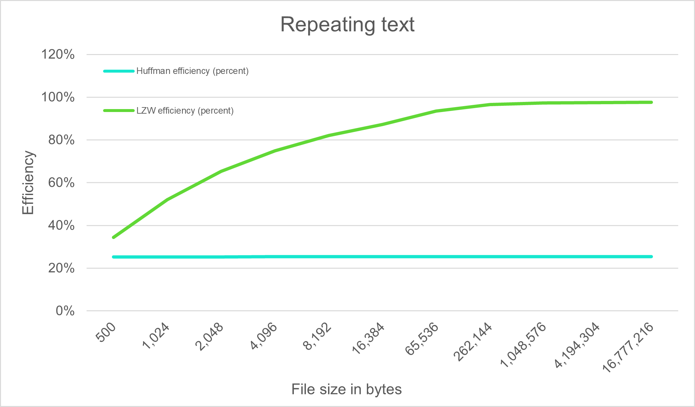
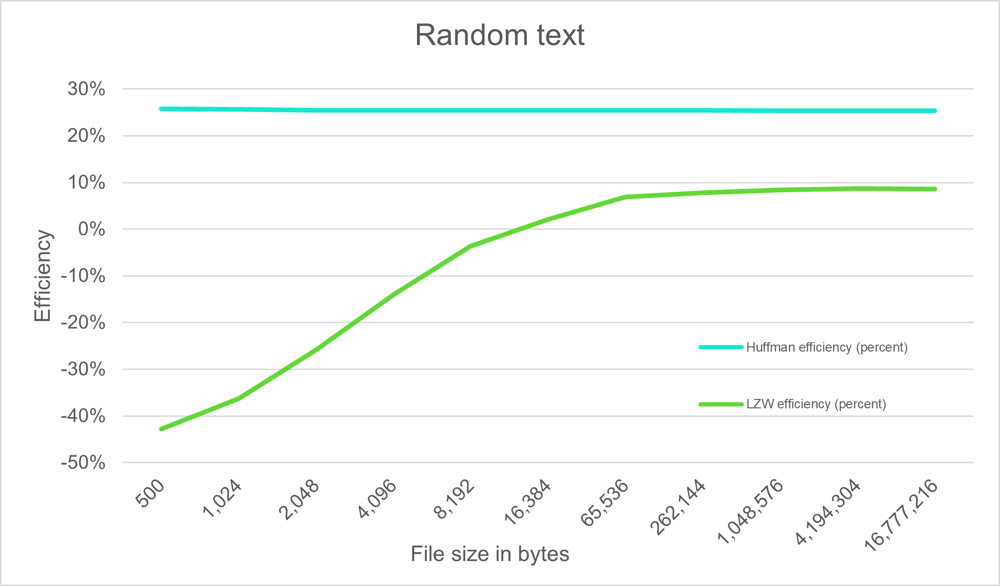

# Implementation
This application is an implementation of Huffman and Lempel-Ziv-Welch (LZW) data compression algorithms.

## UI
- The application features a simple user interface built with Python Flask.
- Users can upload  files through a "Choose File" button, followed by pressing the "Upload" button to proceed with the upload.
- Performance tests are ran alongside the compression process, which is initiated by clicking the "Compress File" button.
- Performance statistics such as efficiency and integrity checks are displayed at the homepage of the application.
- Test coverage statistics are also displayed at the homepage of the application.

To run the application, please refer to the instructions provided in the README on the front page.


## File Handling
- "assets" folder serves as the storage location for both uploaded and compressed files.
- During compression process, uploaded files are processed and read in byte format.

## Compression Algorithms

### Huffman Algorithm

- Huffman tree is built based on the frequency of characters in the data, using a priority queue to ensure that the least frequent characters are at the bottom of the tree.
- Huffman codes are then generated for each character based on their position in the tree, with shorter codes assigned to more frequent characters.
- Data is then compressed by replacing each character with its corresponding Huffman code.
- Compressed data is padded with zeros to ensure it is a multiple of 8 bits and the number of padding bits is stored as the first byte of the compressed data.
- Decompression is done by traversing the Huffman tree using the Huffman codes, starting from the root and moving left for '0' and right for '1', until a terminal node is reached.
- Time complexity for Huffman algorithm is O(n log n) where n is the size of the data. Building the Huffman tree takes O(nlogn), while encoding and decoding takes O(n). Although encoding and decoding are linear, the tree building step dominates, making the overall time complexity O(n log n), which is worse than linear time complexity.

```bash
       (root)
      /      \
    'a'      (node)
           /      \
         'b'      (node)
               /      \
             'c'      'd'
```
Here 'a' is the character with highest frequency and 'd' is the character with lowest frequency. The Huffman codes for each character would be:
- 'a': 0
- 'b': 10
- 'c': 110
- 'd': 111

### LZW Algorithm

- Dictionary is initialised with all possible single byte sequences and their corresponding codes.
- Data is then compressed by finding the longest sequence in the dictionary that matches the data, replacing it with its corresponding code.
- Dictionary is then updated with the found sequence concatenated with the next character in the data. This process is then repeated.
- Compressed data is padded with zeros to ensure it is a multiple of 8 bits and the number of padding bits is stored as the first byte of the compressed data.
- Decompression is done by traversing the dictionary using the codes, updating the dictionary with new sequences as they are found.
- Time complexity of LZW compression and decompression is O(n), where n is the size of the data. In other words the time complexity is linear.

```bash
       (root)
      /      \
    'A'      (node)
           /      \
         'B'      (node)
               /      \
             'AB'      'C'
```

Here 'A', 'B', and 'C' are individual characters and 'AB' is a sequence of characters. Each node is associated with a unique code. During compression, if the sequence 'AB' appears in the input data, it would be replaced with its corresponding code from the dictionary.

### Utility functions
- bits_to_bytes function converts a string of bits to a bytearray, padding with zeros if necessary. It returns the number of padding bits and the bytearray.
- bytes_to_bits function converts a bytearray back to the original bit string removing any padding bits.

## Performance Metrics

- The application calculates and displays performance metrics for both compression algorithms:
  - Integrity checks verify that the decompressed data matches the original data.
  - Compression efficiency is calculated as a percentage. Compression efficiency is calculated as 1 - compressed file size / original file size.

### Results for repeating text

| Repeating text (bytes) | Huffman efficiency (percent) | LZW efficiency (percent) | Huffman file size (bytes) | LZW file size  (bytes) |
|---|---|---|---|---|
| 500 | 25,20 % | 34,40 % | 374 | 328 |
| 1 024 | 25,29 % | 52,15 % | 765 | 490 |
| 2 048 | 25,34 % | 65,28 % | 1 529 | 711 |
| 4 096 | 25,37 % | 74,95 % | 3 057 | 1 026 |
| 8 192 | 25,39 % | 82,09 % | 6 112 | 1 467 |
| 16 384 | 25,40 % | 87,22 % | 12 223 | 2 094 |
| 65 536 | 25,40 % | 93,54 % | 48 889 | 4 231 |
| 262 144 | 25,40 % | 96,50 % | 195 552 | 9 180 |
| 1 048 576 | 25,40 % | 97,31 % | 782 205 | 28 207 |
| 4 194 304 | 25,40 % | 97,51 % | 3 128 817 | 104 313 |
| 16 777 216 | 25,40 % | 97,56 % | 12 515 263 | 408 738 |



Repeating text repeates ABCDEFGHIJKLMNOPQRSTUVWXYZabcdefghijklmnopqrstuvwxyz1234567890. 

Huffman algorithm consistently achieves compression efficiency around 25%. This is expected given its design, as it assigns shorter codes to more frequent bytes, thus handling the compression fairly uniformly regardless of the file size.

LZW compression efficiency increases with the file size with repeating text. The algorithm replaces repeated sequences with shorter codes and more repeating sequences results in better compression. This is reflected in the results, where LZW efficiency increases from ~34% for 500 byte text to ~98% for over 16,8MB text.

LZW has better efficiency for repeating text as expected, outperforming Huffman in compression efficiency especially in larger file sizes.

# Results for random text

| Random text (bytes) | Huffman efficiency (percent) | LZW efficiency (percent) | Huffman file size (bytes) | LZW file size  (bytes) |
|---|---|---|---|---|
| 500 | 25,80 % | -42,80 % | 371 | 714 |
| 1 024 | 25,68 % | -36,23 % | 761 | 1 395 |
| 2 048 | 25,49 % | -25,83 % | 1 526 | 2 577 |
| 4 096 | 25,49 % | -14,11 % | 3 052 | 4 674 |
| 8 192 | 25,45 % | -3,60 % | 6 107 | 8 487 |
| 16 384 | 25,45 % | 2,06 % | 12 214 | 16 047 |
| 65 536 | 25,44 % | 6,86 % | 48 865 | 61 042 |
| 262 144 | 25,41 % | 7,81 % | 195 522 | 241 675 |
| 1 048 576 | 25,41 % | 8,40 % | 782 138 | 960 484 |
| 4 194 304 | 25,41 % | 8,70 % | 3 128 685 | 3 829 435 |
| 16 777 216 | 25,40 % | 8,57 % | 12 515 006 | 15 338 631 |



Random text was generated with Python random module. 

Huffman compression efficiency is similar to the repeating text as expected, given that Huffman does not require patterns or structure in the data to be effective. The algorithm compression efficiency is uniform around 25% across all file sizes even with random text.

LZW compression efficiency is poor with random text as expected, given that the algorithm looks to find and replace repeating sequences from the data to achieve compression. The algorithm struggles to find opportunities for compression, as the data does not have patterns or structure. In fact, with file sizes of less than 16KB the compressed output is larger than the original input. Even after this with larger file sizes the compression efficiency is low and seems to plateau around 8.5%.

Huffman therefore seems as more versatile option for data compression with varying levels of randomness and structure in the data.

## LLM Usage

- The LLM on chat.openai.com has been used to assist in debugging and obtaining information on Python-specific matters. Weekly reports provide more detailed insight into its usage.
