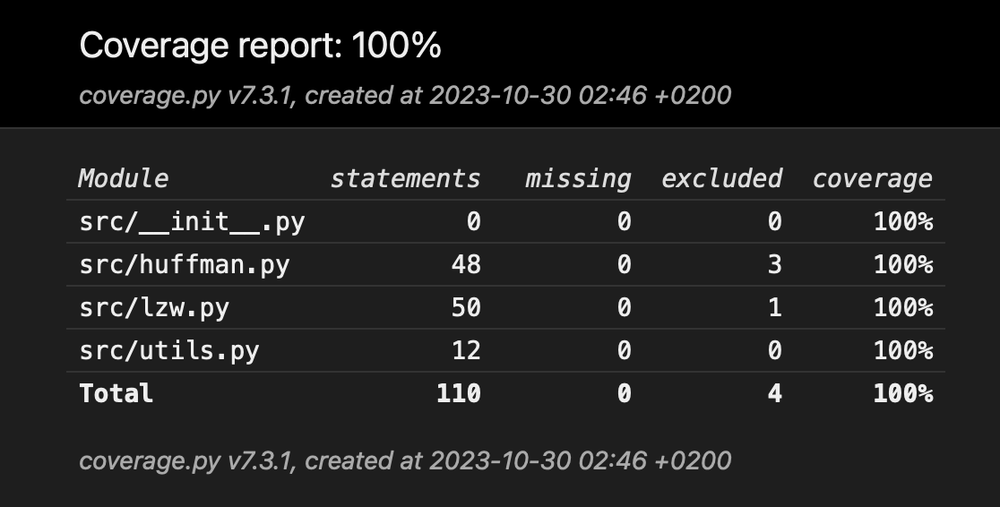
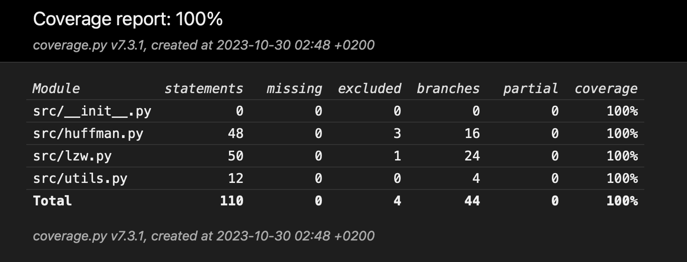

## Unit tests

Test and branch coverage stands at 100%.

Unit tests have been implemented using Python's 'unittest' framework. Test and branch coverage has been measured using Python's 'coverage' package. Tests have been written for files related to the algorithms, but not for files related to the UI or routes.

To run the tests and generate a test coverage report, use the following commands in the terminal:

```bash
coverage run -m unittest discover
coverage html
```



To run the tests and generate a branch coverage report, use the following commands in the terminal:

```bash
coverage run --branch -m unittest discover
coverage html
```


